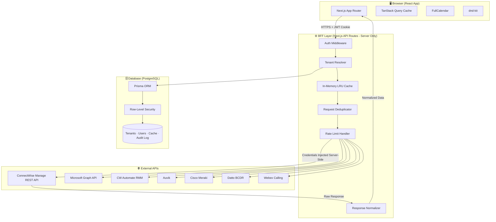
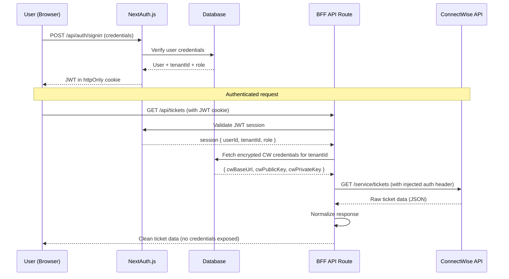
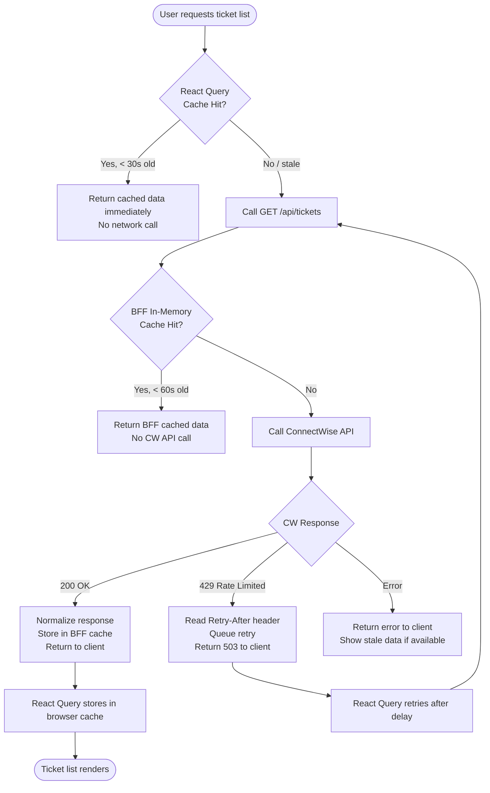
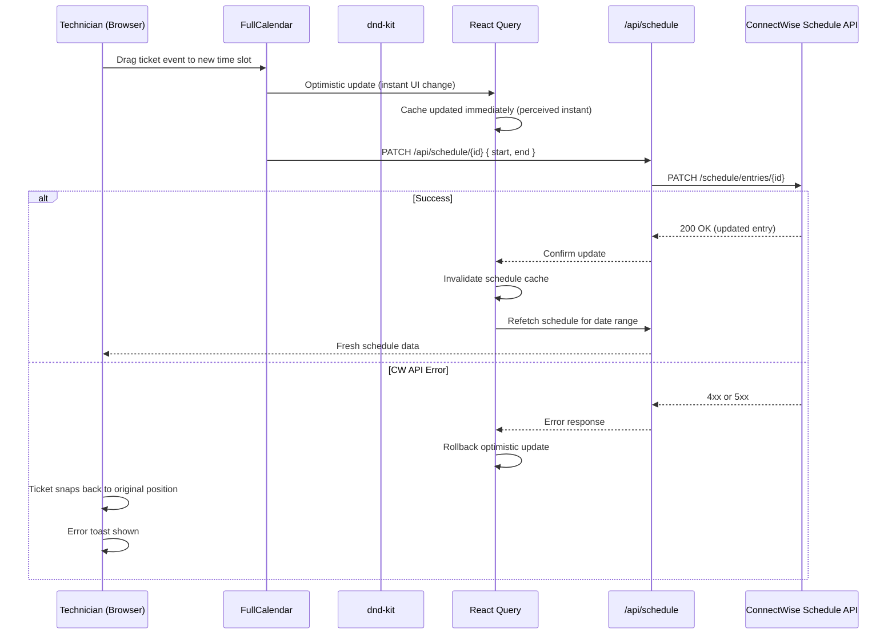
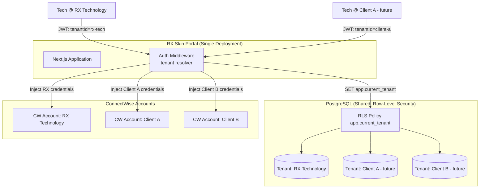
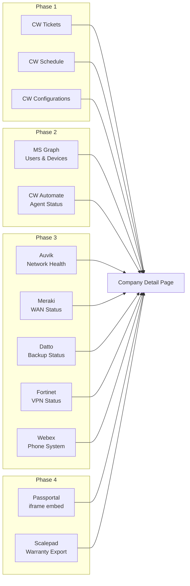
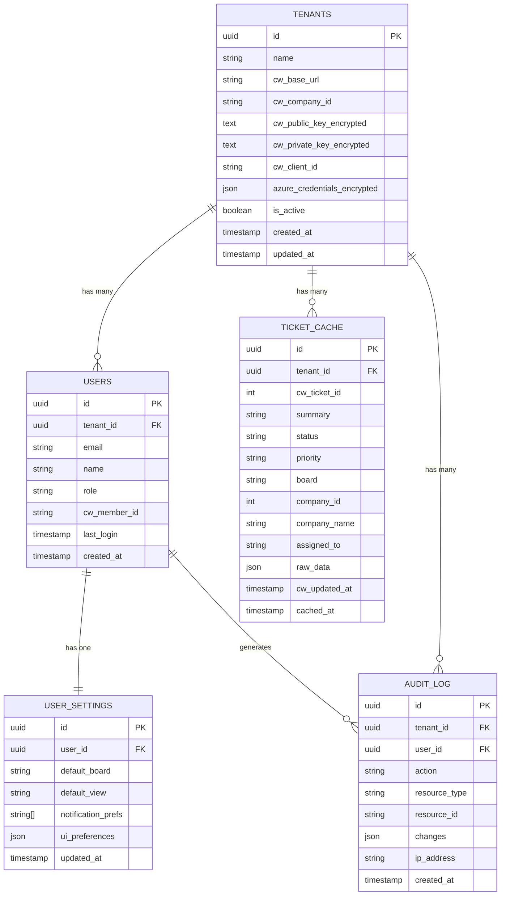
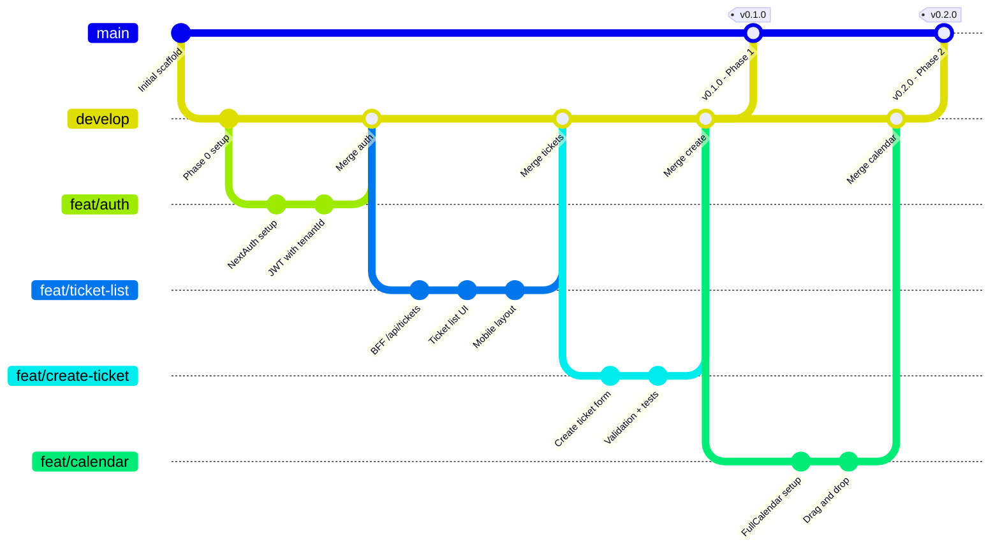
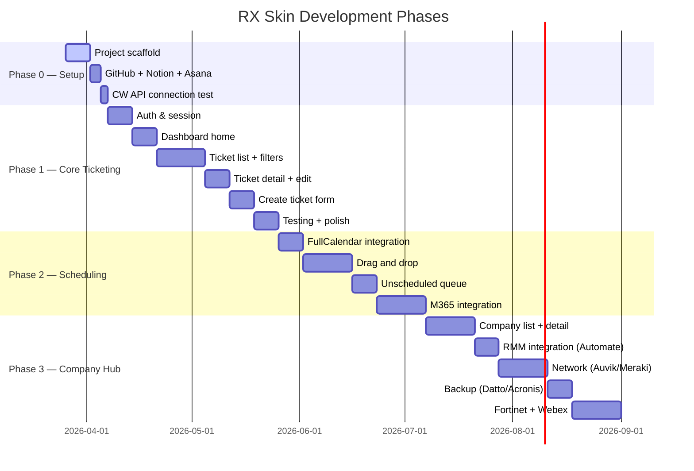

# DIAGRAMS.md — RX Skin Architecture Diagrams

> Mermaid diagrams for the RX Skin system. Render in GitHub, Notion, or any Mermaid-compatible viewer.

---

## 1. System Architecture Overview

---

## 2. Authentication & Session Flow

---

## 3. Caching Data Flow

---

## 4. Drag and Drop Scheduling Flow

---

## 5. Multi-Tenant Architecture

---

## 6. Integration Hub — Company Dashboard Data Sources

---

## 7. Database Schema (Core Tables)

---

## 8. Git Branch Strategy

---

## 9. Phase Roadmap Timeline

---

*Last updated: 2026-03-26*
